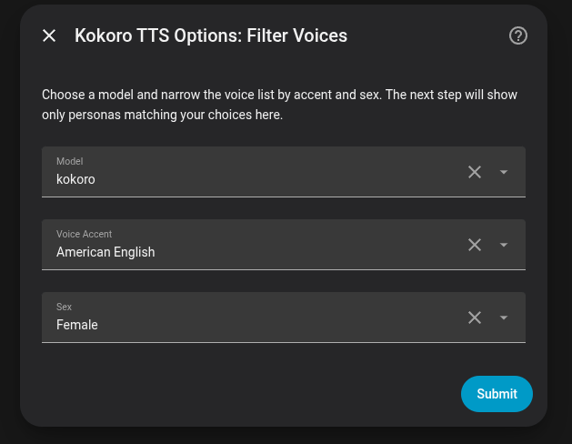
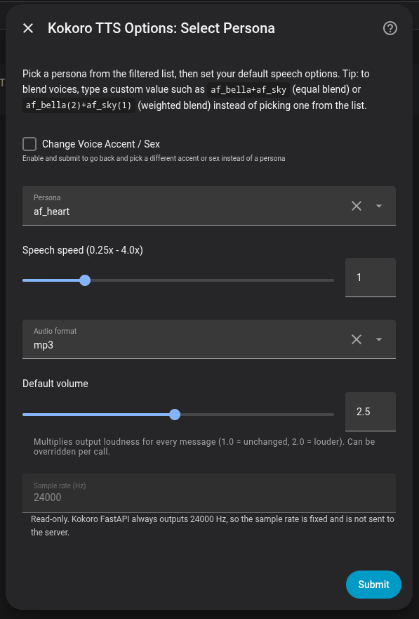
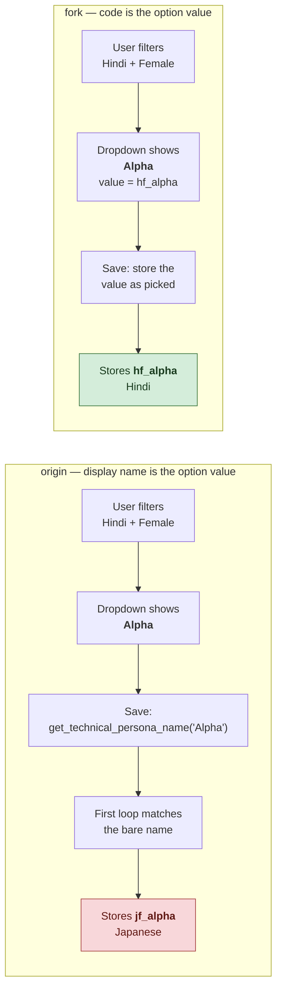
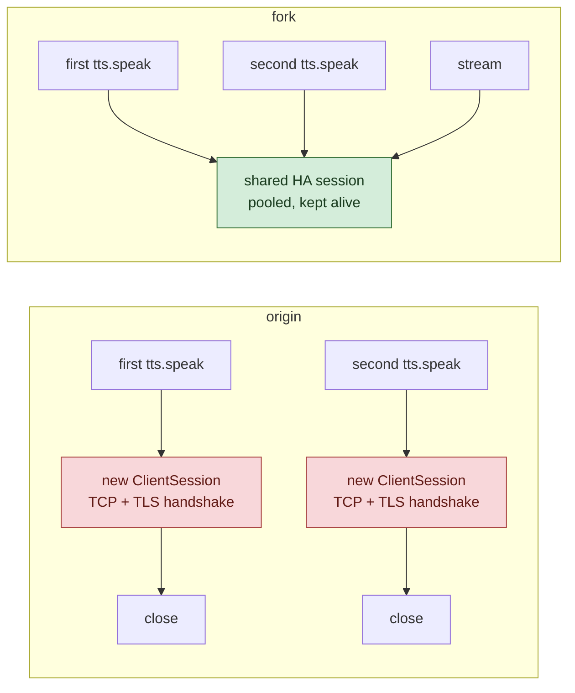
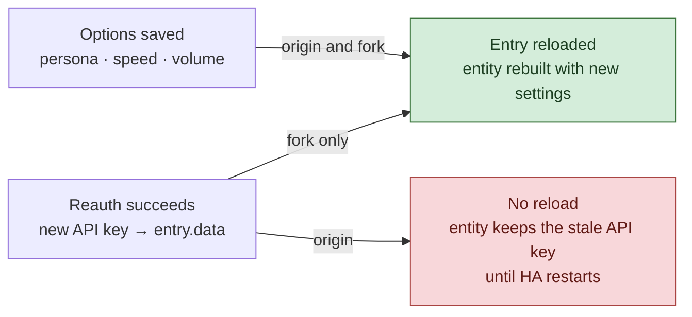

# Where this fork diverges from origin

This fork ([nicandris/Kokoro-TTS](https://github.com/nicandris/Kokoro-TTS)) tracks
[beecho01/Kokoro-TTS](https://github.com/beecho01/Kokoro-TTS) and was last synced with origin
`2026.08.15` ([`48014b9`](https://github.com/beecho01/Kokoro-TTS/commit/48014b9)).

**This document exists so origin can take any of it.** Everything below is offered freely —
no attribution needed, no PR required, no need to ask. Cherry-pick a commit, copy a function, or
just read it as a bug report and write a different fix. Each entry links straight to the
implementation and to the test that proves it.

Some of these are plain bugs still live in origin today; others are deliberate design
disagreements where origin's choice is defensible and the fork simply differs. The table says
which is which, so nobody has to guess what's a fix and what's taste.

Origin's streaming synthesis and the two-step Filters → Persona flow are **not** listed here:
both are origin's own work, merged into the fork and kept.

Throughout, **origin** means [beecho01/Kokoro-TTS](https://github.com/beecho01/Kokoro-TTS) and
**fork** means [nicandris/Kokoro-TTS](https://github.com/nicandris/Kokoro-TTS).

The fork running in Home Assistant, on origin's two-step flow. Four of the differences below
are visible in the right-hand screen alone — the persona shown as a technical code (§1), the
default volume slider (§8), the read-only sample rate (§10), and the blend hint in the
description (§6):

| Step 1 — Filter Voices | Step 2 — Select Persona |
|---|---|
|  |  |

All links are pinned to
[`adf45cf`](https://github.com/nicandris/Kokoro-TTS/commit/adf45cfb2b37e527eafd35547d5009fddc7cfe07)
so they won't rot.

---

## Summary

Ordered by kind, most consequential first, and numbered to match the sections below.

| # | Kind | Difference | Porting effort |
|---|---|---|---|
| 1 | 🐛 Bug | [Store the voice code, not the display name](#-1-store-the-voice-code-not-the-display-name) | Moderate |
| 2 | 🐛 Bug | [Raise `ConfigEntryAuthFailed` on HTTP 401](#-2-raise-configentryauthfailed-on-http-401) | Trivial |
| 3 | 🐛 Bug | [Reuse Home Assistant's shared aiohttp session](#-3-reuse-home-assistants-shared-aiohttp-session) | Trivial |
| 4 | 🐛 Bug | [Derive `unique_id` from the config entry](#-4-derive-unique_id-from-the-config-entry) | One line |
| 5 | 🐛 Bug | [Default language follows the voice, not the filter](#-5-default-language-follows-the-voice-not-the-filter) | Small |
| 6 | 🐛 Bug | [Treat blended voices as unclassifiable](#-6-treat-blended-voices-as-unclassifiable) | Trivial |
| 7 | ✨ Feature | [Classify voices the server reports but the table doesn't list](#-7-classify-voices-the-server-reports-but-the-table-doesnt-list) | Small |
| 8 | ✨ Feature | [Configurable default volume](#-8-configurable-default-volume) | Small |
| 9 | ⚖️ Design | [Reload on any entry change, not just options](#-9-reload-on-any-entry-change-not-just-options) | Trivial |
| 10 | ⚖️ Design | [Sample rate is read-only](#-10-sample-rate-is-read-only) | Small |
| 11 | 🔧 Polish | [`integration_type` in the manifest](#-11-integration_type-in-the-manifest) | One line |
| 12 | 🧰 Infra | [A test suite that runs without Home Assistant](#-12-a-test-suite-that-runs-without-home-assistant) | Self-contained |
| 13 | 🧰 Infra | [CI and automatic releases](#-13-ci-and-automatic-releases) | Self-contained |

Items 2, 3, 4, 6, 9 and 11 are self-contained and apply cleanly against origin's current
tree. Item 1 is the one that matters most for correctness and the one that needs real work,
because origin's two-step flow is built around display names.

---

## 🐛 1. Store the voice code, not the display name

**Bug, and the most consequential one here.**

Origin shows personas in the dropdown by display name, then converts back with
`get_technical_persona_name(display_name)` on save. That reverse lookup is not injective:

| Code | Language | Display name |
|---|---|---|
| `jf_alpha` | Japanese | Alpha |
| `hf_alpha` | Hindi | Alpha |
| `am_santa` | American English | Santa |
| `em_santa` | Spanish | Santa |
| `pm_santa` | Brazilian Portuguese | Santa |
| `ef_dora` | Spanish | Dora |
| `pf_dora` | Brazilian Portuguese | Dora |
| `em_alex` | Spanish | Alex |
| `pm_alex` | Brazilian Portuguese | Alex |

`get_technical_persona_name` tries an exact match on the bare display name first, iterating
`PERSONA_MAPPINGS` in definition order and returning the first hit. For "Alpha" that is
`jf_alpha`, because Japanese is defined before Hindi.

**The two-step flow makes this more likely, not less.** `get_persona_display_name` returns the
*bare* name — "Alpha", with no qualifier — precisely when both an accent and a sex filter are
active, because the qualifier would be redundant. That is the normal path through the new
wizard. So filtering to Hindi + Female shows "Alpha", and saving it stores `jf_alpha`: the
Japanese voice, silently, with no error and no warning in the log.

The qualified variants (`Alpha (Hindi, Female)`) only appear when a filter is left on "All",
and those resolve correctly via the second loop. The collision is specific to the filtered
case — the case the two-step flow steers users into.

Running origin's own two helpers back to back over all 54 voices, **5 do not survive the
round trip** when both filters are set:

| Picked | Actually stored | You get |
|---|---|---|
| `hf_alpha` (Hindi) | `jf_alpha` | Japanese |
| `em_santa` (Spanish) | `am_santa` | American English |
| `pm_santa` (Brazilian Portuguese) | `am_santa` | American English |
| `pf_dora` (Brazilian Portuguese) | `ef_dora` | Spanish |
| `pm_alex` (Brazilian Portuguese) | `em_alex` | Spanish |

Brazilian Portuguese is hit hardest: it has exactly three voices, and **all three** are
unreachable through the filtered picker — selecting any of them gives a different language.

The qualifier is what makes the label unique, and it is dropped exactly when both filters are
set. Carrying the code as the option value removes the lookup rather than trying to make it
unambiguous.

**Fork:** the selector's option *value* is the code and the *label* is the friendly name, so no
reverse mapping is needed or exists — see
[`get_persona_select_options`](https://github.com/nicandris/Kokoro-TTS/blob/adf45cfb2b37e527eafd35547d5009fddc7cfe07/custom_components/kokoro_tts/config_flow.py#L127-L156).
The save paths just store what was picked
([config flow](https://github.com/nicandris/Kokoro-TTS/blob/adf45cfb2b37e527eafd35547d5009fddc7cfe07/custom_components/kokoro_tts/config_flow.py#L516-L520),
[options flow](https://github.com/nicandris/Kokoro-TTS/blob/adf45cfb2b37e527eafd35547d5009fddc7cfe07/custom_components/kokoro_tts/config_flow.py#L687-L691)).

**Test:** [`test_select_options_resolve_shared_display_names`](https://github.com/nicandris/Kokoro-TTS/blob/adf45cfb2b37e527eafd35547d5009fddc7cfe07/tests/test_persona_helpers.py#L86-L93)
pins `jf_alpha` and `hf_alpha` to distinct values with distinct labels.

**Porting note:** this is the one that needs real work origin, since the two-step flow assumes
display names in both `_persona_schema` and the prefill logic. The change is mechanical
(`{"value": code, "label": name}` options, then delete `get_technical_persona_name` and its call
sites) but it touches most of `config_flow.py`. Migration for existing entries is not needed —
entries already store codes; only the in-flow representation changes.

---

## 🐛 2. Raise `ConfigEntryAuthFailed` on HTTP 401

**Bug.** Origin has a complete reauth flow — `async_step_reauth`, `async_step_reauth_confirm`,
the translation strings, all of it. Nothing can ever trigger it.

Home Assistant starts a reauth flow when an integration raises `ConfigEntryAuthFailed`. Origin
raises a plain `RuntimeError` for every status code, 401 included, so when a Kokoro server's API
key is rotated the integration simply logs errors forever and the user is never prompted.

**Fork:** one [`_raise_for_status`](https://github.com/nicandris/Kokoro-TTS/blob/adf45cfb2b37e527eafd35547d5009fddc7cfe07/custom_components/kokoro_tts/tts.py#L172-L189)
shared by the buffered and streaming paths, so both behave identically. Everything that isn't a
401 still raises `RuntimeError` with origin's existing friendly message map.

**Tests:** [`test_get_tts_audio_401_raises_auth_failed`](https://github.com/nicandris/Kokoro-TTS/blob/adf45cfb2b37e527eafd35547d5009fddc7cfe07/tests/test_tts_request.py#L82-L88)
and [`test_stream_401_raises_auth_failed`](https://github.com/nicandris/Kokoro-TTS/blob/adf45cfb2b37e527eafd35547d5009fddc7cfe07/tests/test_tts_streaming.py#L213-L221).

> Worth noting even if nothing else here is adopted: the reauth flow origin already wrote is
> dead code until this changes.

---

## 🐛 3. Reuse Home Assistant's shared aiohttp session

**Bug.** Origin opens `aiohttp.ClientSession(timeout=timeout)` for every TTS call
([`tts.py:240`](https://github.com/beecho01/Kokoro-TTS/blob/48014b9/custom_components/kokoro_tts/tts.py#L240))
and again for every stream
([`tts.py:327`](https://github.com/beecho01/Kokoro-TTS/blob/48014b9/custom_components/kokoro_tts/tts.py#L327)).
A fresh session per call means no connection reuse or keep-alive, and it sidesteps the client
Home Assistant has already built and manages the lifecycle of.

The cost is highest on the streaming path, where it is one entire session per spoken reply.

**Fork:** [`tts.py:268`](https://github.com/nicandris/Kokoro-TTS/blob/adf45cfb2b37e527eafd35547d5009fddc7cfe07/custom_components/kokoro_tts/tts.py#L262-L275)
(buffered) and [`tts.py:350`](https://github.com/nicandris/Kokoro-TTS/blob/adf45cfb2b37e527eafd35547d5009fddc7cfe07/custom_components/kokoro_tts/tts.py#L344-L356)
(streaming), both via `async_get_clientsession(self.hass)`. The per-request timeout moves onto
the `session.post(...)` call, since the session is shared and outlives any single request.

**Test:** [`test_stream_uses_shared_session`](https://github.com/nicandris/Kokoro-TTS/blob/adf45cfb2b37e527eafd35547d5009fddc7cfe07/tests/test_tts_streaming.py#L231-L251)
— fails the test outright if `aiohttp.ClientSession` is constructed at all.

---

## 🐛 4. Derive `unique_id` from the config entry

**Bug.** Origin sets `self._attr_unique_id = f"kokoro_tts_{name}"`, and `name` is always the
module constant `"kokoro"` — no name field is collected anywhere in the config flow. So the
unique ID is the same string for every config entry, and a second Kokoro server collides with
the first.

**Fork:** the entry ID is passed in at
[`tts.py:100`](https://github.com/nicandris/Kokoro-TTS/blob/adf45cfb2b37e527eafd35547d5009fddc7cfe07/custom_components/kokoro_tts/tts.py#L99-L111)
and used directly at
[`tts.py:134`](https://github.com/nicandris/Kokoro-TTS/blob/adf45cfb2b37e527eafd35547d5009fddc7cfe07/custom_components/kokoro_tts/tts.py#L132-L135).
Unique by construction, and stable across restarts.

**Test:** [`test_unique_id_comes_from_entry_id`](https://github.com/nicandris/Kokoro-TTS/blob/adf45cfb2b37e527eafd35547d5009fddc7cfe07/tests/test_tts_entity.py#L63-L66).

---

## 🐛 5. Default language follows the voice, not the filter

**Bug.** Origin derives `_attr_default_language` from the configured *accent filter*
(`LANGUAGE_HA_CODE_MAP.get(language, ...)`). That filter defaults to `"All Languages"`, which
isn't in the map — so it falls through to `en` even when the selected voice is `jf_alpha`.

Origin's change to advertise **all** supported languages is correct and this fork adopted it;
this is only about which one is the *default*.

**Fork:** derived from the voice code instead, at
[`tts.py:150`](https://github.com/nicandris/Kokoro-TTS/blob/adf45cfb2b37e527eafd35547d5009fddc7cfe07/custom_components/kokoro_tts/tts.py#L144-L153),
using [`LANG_CODE_TO_HA_LOCALE`](https://github.com/nicandris/Kokoro-TTS/blob/adf45cfb2b37e527eafd35547d5009fddc7cfe07/custom_components/kokoro_tts/const.py#L163-L177).
It reuses the existing `_get_lang_code` helper, which already prefers the filter and falls back
to the code prefix — so an explicitly chosen accent still wins.

One constraint worth copying: the map's values use `en-GB` and `pt-BR` to match
`SUPPORTED_LANGUAGES`. A default outside the advertised set makes Home Assistant drop the entity
from pipelines.

**Tests:** [`test_default_language_follows_persona`](https://github.com/nicandris/Kokoro-TTS/blob/adf45cfb2b37e527eafd35547d5009fddc7cfe07/tests/test_tts_entity.py#L34-L42)
and `test_default_language_is_always_advertised` just below it, which enforces that constraint.

---

## 🐛 6. Treat blended voices as unclassifiable

**Bug** (in the fork's own earlier version of item 7 — origin never had this, but will inherit
it if it takes item 7).

Kokoro supports blends: `af_bella+af_sky`, or weighted `af_bella(2)+af_sky(1)`. Both the README
and the UI hint advertise this. A blend has no single language or sex, but the prefix parser
happily reads the *first* component and calls the whole thing American English / Female — so a
configured blend disappears from the form the moment a different accent filter is selected.

**Fork:** an explicit guard at the top of `derive_persona_info` —
[`config_flow.py:90`](https://github.com/nicandris/Kokoro-TTS/blob/adf45cfb2b37e527eafd35547d5009fddc7cfe07/custom_components/kokoro_tts/config_flow.py#L86-L92).
Unclassifiable voices are always offered back rather than filtered out, at
[`config_flow.py:707`](https://github.com/nicandris/Kokoro-TTS/blob/adf45cfb2b37e527eafd35547d5009fddc7cfe07/custom_components/kokoro_tts/config_flow.py#L705-L722).

**Test:** [`test_derive_persona_info_blend_is_unclassifiable`](https://github.com/nicandris/Kokoro-TTS/blob/adf45cfb2b37e527eafd35547d5009fddc7cfe07/tests/test_persona_helpers.py#L37-L42).

---

## ✨ 7. Classify voices the server reports but the table doesn't list

**Feature.** `PERSONA_MAPPINGS` is a static table. A Kokoro server running a newer voice pack, a
custom build, or anything else not in that table reports voices the integration can't classify —
and origin drops them from the list whenever a language or sex filter is active.

**Fork:** [`derive_persona_info`](https://github.com/nicandris/Kokoro-TTS/blob/adf45cfb2b37e527eafd35547d5009fddc7cfe07/custom_components/kokoro_tts/config_flow.py#L78-L107)
parses the `<lang><sex>_<name>` convention that every Kokoro code follows, so an unknown
`af_brandnew` still classifies as American English / Female and filters correctly. The static
table stays authoritative where it has an entry; this is only the fallback, used by
[`filter_personas_by_language_and_sex`](https://github.com/nicandris/Kokoro-TTS/blob/adf45cfb2b37e527eafd35547d5009fddc7cfe07/custom_components/kokoro_tts/config_flow.py#L105-L125).

**Test:** [`test_filter_unmapped_voice_visible_under_language_filter`](https://github.com/nicandris/Kokoro-TTS/blob/adf45cfb2b37e527eafd35547d5009fddc7cfe07/tests/test_persona_helpers.py#L50-L58).

---

## ✨ 8. Configurable default volume

**Feature.** Origin supports `volume_multiplier` as a per-call option only; the default is
hardcoded to `1.0`, so getting consistent loudness means passing it on every single service call.

**Fork:** a slider (0.1–5.0) in both the setup and options flows — visible as *Default volume*
in the step 2 screenshot at the top of this document —
[`config_flow.py:386`](https://github.com/nicandris/Kokoro-TTS/blob/adf45cfb2b37e527eafd35547d5009fddc7cfe07/custom_components/kokoro_tts/config_flow.py#L386-L394)
— resolved as the fallback for the per-call option at
[`tts.py:204`](https://github.com/nicandris/Kokoro-TTS/blob/adf45cfb2b37e527eafd35547d5009fddc7cfe07/custom_components/kokoro_tts/tts.py#L204-L217).
Per-call still overrides, exactly as before.

Two details that differ from origin's handling:

- It is sent **always**, not only when `!= 1.0`
  ([`tts.py:239`](https://github.com/nicandris/Kokoro-TTS/blob/adf45cfb2b37e527eafd35547d5009fddc7cfe07/custom_components/kokoro_tts/tts.py#L236-L240)),
  so an explicit `1.0` can override a server-side default rather than being silently omitted.
- Both paths resolve it through the same `_resolve_options`, so the configured default applies
  to streaming as well. Origin's `_resolve_options` falls back to the `DEFAULT_VOLUME_MULTIPLIER`
  constant — consistent for them, since they have no configured default to fall back to, but it
  means adding the setting requires changing the resolver rather than just the schema.

**Tests:** [`test_default_volume_multiplier_applied`](https://github.com/nicandris/Kokoro-TTS/blob/adf45cfb2b37e527eafd35547d5009fddc7cfe07/tests/test_tts_request.py#L104-L109)
and [`test_stream_applies_default_volume_multiplier`](https://github.com/nicandris/Kokoro-TTS/blob/adf45cfb2b37e527eafd35547d5009fddc7cfe07/tests/test_tts_streaming.py#L193-L201).

---

## ⚖️ 9. Reload on any entry change, not just options

**Design disagreement — but Home Assistant has an opinion here.** Origin subclasses
`OptionsFlowWithReload`, which reloads the entry when the flow ends by calling
`async_create_entry` with changed options. That covers the common case, but not a reauth that
writes a new API key into `entry.data` — after a successful reauth the entity keeps using the
old key until Home Assistant restarts.

The two approaches are explicitly mutually exclusive. From `OptionsFlowWithReload`'s own
docstring in `homeassistant/config_entries.py`:

> It's not allowed to use this class if the integration uses config entry update listeners.

So this isn't a free choice of one, the other, or both — an integration picks exactly one.
This fork picks the listener because it covers strictly more:

**Fork:** an update listener registered in
[`__init__.py:28`](https://github.com/nicandris/Kokoro-TTS/blob/adf45cfb2b37e527eafd35547d5009fddc7cfe07/custom_components/kokoro_tts/__init__.py#L25-L31),
reloading via
[`async_reload_entry`](https://github.com/nicandris/Kokoro-TTS/blob/adf45cfb2b37e527eafd35547d5009fddc7cfe07/custom_components/kokoro_tts/__init__.py#L38-L45).
It fires on any entry update, options and data alike.

Accordingly the options flow here is deliberately plain `OptionsFlow`
([`config_flow.py:600`](https://github.com/nicandris/Kokoro-TTS/blob/adf45cfb2b37e527eafd35547d5009fddc7cfe07/custom_components/kokoro_tts/config_flow.py#L600-L607)).
Anyone porting this should switch one way or the other, not add the listener on top of
`OptionsFlowWithReload` — that reloads the entry twice on every options save.

**Test:** [`test_setup_entry_registers_options_reload_listener`](https://github.com/nicandris/Kokoro-TTS/blob/adf45cfb2b37e527eafd35547d5009fddc7cfe07/tests/test_setup.py#L35-L48).

---

## ⚖️ 10. Sample rate is read-only

**Design disagreement.** Kokoro FastAPI's output is fixed at 24000 Hz. Origin presents
`sample_rate` as an editable config field and advertises it in `SUPPORTED_OPTIONS`, but the value
is never put in the request payload — so changing it does nothing, silently.

**Fork:** kept visible for transparency but rendered read-only
([`config_flow.py:396`](https://github.com/nicandris/Kokoro-TTS/blob/adf45cfb2b37e527eafd35547d5009fddc7cfe07/custom_components/kokoro_tts/config_flow.py#L396-L401)),
sourced from a named constant
([`const.py:30`](https://github.com/nicandris/Kokoro-TTS/blob/adf45cfb2b37e527eafd35547d5009fddc7cfe07/custom_components/kokoro_tts/const.py#L29-L31)),
and dropped from `SUPPORTED_OPTIONS`. The field's description states plainly that it is fixed and
not sent.

Removing the field entirely would be just as valid — the point is only that a control which does
nothing shouldn't look adjustable.

---

## 🔧 11. `integration_type` in the manifest

**Polish.** One line —
[`manifest.json:9`](https://github.com/nicandris/Kokoro-TTS/blob/adf45cfb2b37e527eafd35547d5009fddc7cfe07/custom_components/kokoro_tts/manifest.json#L9).
Without it Home Assistant falls back to a default classification, which affects how the
integration is grouped and described in the UI. Origin already sets `iot_class`.

---

## 🧰 12. A test suite that runs without Home Assistant

**Infrastructure**, and entirely self-contained — it adds files, changes none.

Home Assistant is a heavy dependency to install just to test a custom component, so
[`tests/conftest.py`](https://github.com/nicandris/Kokoro-TTS/blob/adf45cfb2b37e527eafd35547d5009fddc7cfe07/tests/conftest.py)
registers minimal stub modules in `sys.modules` before the integration is imported. The stubs
install *only* when the real package isn't importable, so adding `homeassistant` to the test
environment later transparently runs everything against the real thing instead.

63 tests, well under a second, no HA install:

| File | Covers |
|---|---|
| [`test_persona_helpers.py`](https://github.com/nicandris/Kokoro-TTS/blob/adf45cfb2b37e527eafd35547d5009fddc7cfe07/tests/test_persona_helpers.py) | Classification, filtering, display names, unique-id hashing |
| [`test_tts_entity.py`](https://github.com/nicandris/Kokoro-TTS/blob/adf45cfb2b37e527eafd35547d5009fddc7cfe07/tests/test_tts_entity.py) | Language advertising, lang-code resolution, error map |
| [`test_tts_request.py`](https://github.com/nicandris/Kokoro-TTS/blob/adf45cfb2b37e527eafd35547d5009fddc7cfe07/tests/test_tts_request.py) | The buffered request path, 401 handling, volume |
| [`test_tts_streaming.py`](https://github.com/nicandris/Kokoro-TTS/blob/adf45cfb2b37e527eafd35547d5009fddc7cfe07/tests/test_tts_streaming.py) | Sentence splitting, tail flush, format fallback, streaming errors |
| [`test_config_flow_steps.py`](https://github.com/nicandris/Kokoro-TTS/blob/adf45cfb2b37e527eafd35547d5009fddc7cfe07/tests/test_config_flow_steps.py) | The two-step flow: filter persistence, back-navigation, prefill |
| [`test_setup.py`](https://github.com/nicandris/Kokoro-TTS/blob/adf45cfb2b37e527eafd35547d5009fddc7cfe07/tests/test_setup.py) | Entry setup wiring and the reload listener |

`test_config_flow_steps.py` and `test_tts_streaming.py` cover origin's own features and should
port with little more than an import change.

Run with `python -m pytest`
([`pytest.ini`](https://github.com/nicandris/Kokoro-TTS/blob/adf45cfb2b37e527eafd35547d5009fddc7cfe07/pytest.ini),
[`requirements_test.txt`](https://github.com/nicandris/Kokoro-TTS/blob/adf45cfb2b37e527eafd35547d5009fddc7cfe07/requirements_test.txt)).

---

## 🧰 13. CI and automatic releases

**Infrastructure**, self-contained.

- [`tests.yml`](https://github.com/nicandris/Kokoro-TTS/blob/adf45cfb2b37e527eafd35547d5009fddc7cfe07/.github/workflows/tests.yml)
  — pytest on Python 3.13 and 3.14.
- [`release.yml`](https://github.com/nicandris/Kokoro-TTS/blob/adf45cfb2b37e527eafd35547d5009fddc7cfe07/.github/workflows/release.yml)
  — on a push to `main`, reads the version from `manifest.json`, and if no release with that tag
  exists, cuts one using the matching `CHANGELOG.md` section as the release notes. Bumping the
  manifest version is the entire release process; HACS picks it up with no manual step.

---

## Licensing

This fork carries [CC-BY-NC-SA-4.0](https://github.com/nicandris/Kokoro-TTS/blob/adf45cfb2b37e527eafd35547d5009fddc7cfe07/LICENSE),
matching the badge origin displays. Origin has no `LICENSE` file in the repository, which
leaves the terms ambiguous for anyone packaging or forking it — worth adding regardless of
anything else in this document.

To be unambiguous about the code above: consider it available to origin under whatever terms
suit the project, including relicensing to match. Nothing here needs to be negotiated.
